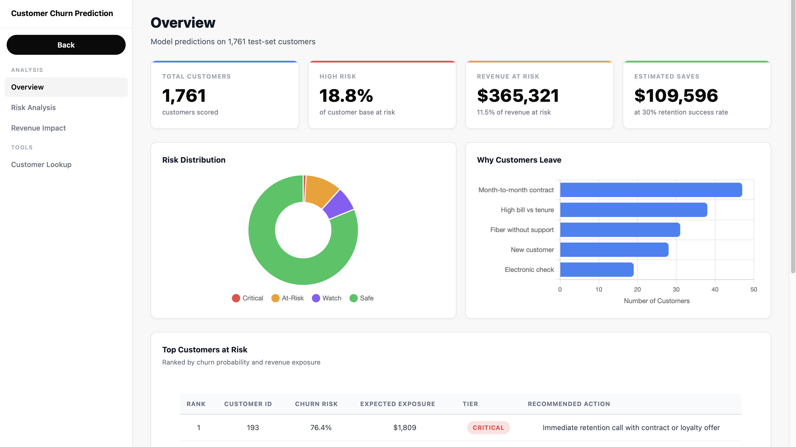

# Customer Churn Prediction System

[](https://www.python.org/)
[](https://fastapi.tiangolo.com/)
[](https://scikit-learn.org/)
[](LICENSE)

This is a production ready customer churn prediction system for telecom retention teams. It predicts churn probability, ranks customers by revenue exposure, recommends retention actions, and estimates campaign return on investment.

## Dashboard Preview

### Landing Page

<p align="center">
  
</p>

### Campaign Overview

<p align="center">
  
</p>

### Risk Analysis

<p align="center">
  
</p>

### Revenue Impact

<p align="center">
  
</p>

### Customer Lookup

<p align="center">
  
</p>

## What This Project Does

This project helps answer three business questions:

1. Which customers are most likely to churn?
2. Which customers should the retention team contact first?
3. How much revenue can a retention campaign protect?

The system combines a trained machine learning model, a FastAPI backend, an interactive dashboard, and business focused reporting.

## Key Results

| Metric | Value |
| --- | --- |
| Customers analyzed | 7,043 |
| High risk customers identified | 54 |
| Revenue at risk | $81,197 |
| Potential saves | $24,359 |
| AUC ROC | 0.79 |
| AUC PR | 0.23 |
| Cost optimized threshold | 0.23 |

## Machine Learning Models Tested

This project compares eight classification models on the same processed train and test sets. Each model uses SMOTE during training to handle class imbalance. The comparison script is available at `src/compare_models.py`, and the full results are saved in `reports/model_comparison.csv` and `reports/model_comparison.md`.

Best model from this comparison: Logistic Regression.

| Rank | Model | AUC ROC | AUC PR | Best threshold | Business value | Precision | Recall | F1 |
| --- | --- | --- | --- | --- | --- | --- | --- | --- |
| 1 | Logistic Regression | 0.8024 | 0.2545 | 0.28 | $3,575 | 0.2387 | 0.5766 | 0.3376 |
| 2 | Gradient Boosting | 0.7933 | 0.2457 | 0.27 | $3,425 | 0.2332 | 0.5839 | 0.3333 |
| 3 | Random Forest | 0.7787 | 0.2184 | 0.34 | $3,050 | 0.2349 | 0.5109 | 0.3218 |
| 4 | AdaBoost | 0.7963 | 0.2360 | 0.48 | $3,000 | 0.2708 | 0.3796 | 0.3161 |
| 5 | Decision Tree | 0.7266 | 0.2235 | 0.30 | $2,975 | 0.2533 | 0.4234 | 0.3169 |
| 6 | KNN | 0.7811 | 0.2143 | 0.32 | $2,450 | 0.2052 | 0.6350 | 0.3102 |
| 7 | Extra Trees | 0.7794 | 0.2159 | 0.38 | $2,375 | 0.2487 | 0.3504 | 0.2909 |
| 8 | Gaussian Naive Bayes | 0.7881 | 0.2202 | 0.53 | $2,200 | 0.2761 | 0.2701 | 0.2731 |

Business value is calculated as:

```text
true positives * 150 - flagged customers * 25
```

This reflects the project assumption that a correctly retained churner saves about `$150`, while every customer contacted costs `$25`.

### Current Production Artifact

The current saved model artifact used by the API is still a Random Forest model. Its model card reports:

| Metric | Result |
| --- | --- |
| AUC ROC | 0.79 |
| AUC PR | 0.23 |
| Precision at threshold 0.23 | 46 percent |
| Recall at threshold 0.23 | 65 percent |
| Brier score | 0.0794 |

The comparison shows that Logistic Regression is the best candidate on the current held out test set. The production artifact remains unchanged in this update so the working application behavior stays stable.

## Main Features

| Feature | Description |
| --- | --- |
| Churn prediction API | Scores individual customers using the trained production model |
| Portfolio dashboard | Shows customer risk, revenue exposure, and campaign metrics |
| Risk segmentation | Groups customers into critical, high, medium, and low risk tiers |
| Revenue impact analysis | Estimates exposed revenue and expected retention value |
| ROI calculator | Compares outreach cost against expected saved revenue |
| Customer lookup | Lets users test churn risk for a single customer profile |
| Model reporting | Includes model metadata, plots, and priority contact list |

## Quick Start

### Clone And Install

```bash
git clone https://github.com/pranjalts07/customer-churn-prediction.git
cd customer-churn-prediction
pip install -r requirements.txt
```

### Run Locally

```bash
uvicorn app.main:app --reload --host 0.0.0.0 --port 8000
```

Open the dashboard:

```bash
http://localhost:8000
```

### Test The API

```bash
curl http://localhost:8000/health
```

```bash
curl -X POST http://localhost:8000/predict \
  -H "Content-Type: application/json" \
  -d '{
    "tenure": 12,
    "MonthlyCharges": 65.0,
    "TotalCharges": 780.0,
    "SeniorCitizen": 0
  }'
```

```bash
curl http://localhost:8000/insights/global
```

## API Endpoints

| Method | Endpoint | Purpose |
| --- | --- | --- |
| GET | `/` | Interactive dashboard |
| GET | `/health` | Service and model health check |
| POST | `/predict` | Predict churn for one customer |
| GET | `/insights/global` | Portfolio level statistics |
| GET | `/insights/all-customers` | Ranked customer risk list |
| GET | `/insights/roi` | Retention campaign ROI calculation |

## Model Approach

The model workflow is built to support retention prioritization rather than only raw accuracy. It uses engineered customer features, classifier comparison, probability scores, and a cost optimized decision threshold.

Core workflow:

```text
Customer data
Feature engineering
Classifier comparison
Best model selection
Churn probability
Cost optimized threshold
Risk tier and retention recommendation
```

Important features include:

| Feature | Business meaning |
| --- | --- |
| `is_month_to_month` | Month to month customers have lower commitment |
| `monthly_charge_per_tenure` | High cost relative to tenure can signal price pressure |
| `tenure` | Longer tenure usually means higher stability |
| `is_honeymoon_period` | Early lifecycle customers churn more often |
| `service_bundle_depth` | More bundled services increase switching friction |

## Project Structure

```text
customer-churn-prediction/
  app/
    main.py
    templates/
      index.html
  data/
    raw/
      telco_churn.csv
    processed/
      train.parquet
      test.parquet
  Images/
    Landing page.png
    Overview.png
    Risk Analysis.png
    Revenue Impact.png
    Customer Lookup.png
  models/
    trained model artifact
    model_card.json
    plots/
  reports/
    priority_contact_list.csv
  src/
    calibration.py
    config.py
    data_pipeline.py
    evaluate.py
    fairness.py
    train.py
  tests/
    test_api.py
  requirements.txt
  startup.sh
  README.md
```

## Training Workflow

Run the data pipeline:

```bash
python src/data_pipeline.py
```

Train the model:

```bash
python src/train.py
```

Evaluate model performance:

```bash
python src/evaluate.py
```

Run fairness checks:

```bash
python src/fairness.py
```

## Testing

```bash
python -m pytest
```

The test suite covers the FastAPI health check, dashboard route, global insights endpoint, and prediction endpoint.

## Run The Application

### Local Startup Script

```bash
./startup.sh
```

## Known Limitations

| Limitation | Note |
| --- | --- |
| Probability calibration | Use high probability scores for ranking and review rather than as exact probabilities |
| Dataset size | The project uses the IBM Telco churn dataset |
| CLV estimate | Revenue impact uses a simplified 24 month value window |
| Model drift | Retrain periodically when customer behavior or product pricing changes |

## Tech Stack

| Area | Tools |
| --- | --- |
| Backend | FastAPI, Uvicorn |
| Machine learning | scikit-learn, imbalanced-learn, Logistic Regression, Random Forest, Gradient Boosting |
| Data | pandas, numpy, pyarrow |
| Analysis | SHAP, matplotlib, seaborn |
| Testing | pytest, FastAPI TestClient |

## License

This project is released under the MIT License. See [LICENSE](LICENSE) for details.

## Author

Pranjal Tariga Suresh

[GitHub](https://github.com/pranjalts07)
